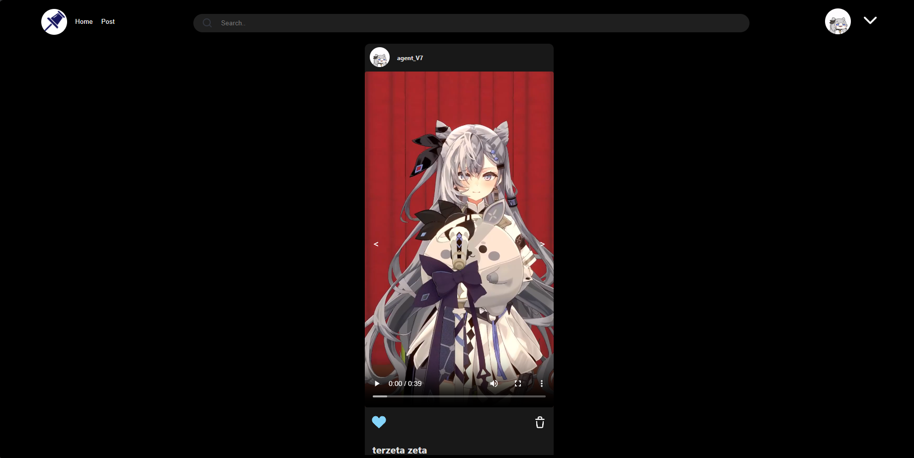

# ForPin-SPA

> Disusun untuk memenuhi Tugas Milestone 2 IF3110 -  Web Services using SOAP and REST

## Daftar Isi

-   [Deskripsi Aplikasi Web](#deskripsi-aplikasi-web)
-   [Screenshot Tampilan Aplikasi](#screenshot-tampilan-aplikasi)
-   [Pembagian Tugas](#pembagian-tugas)

## Deskripsi Aplikasi Web

ForPin SPA merupakan antar muka yang digunakan untuk menjembatani pengguna dengan rest service ForPin dengan menggunakan ReactTS dan docker sebagai container.

## Screenshot Tampilan Aplikasi

### Login

### Home

### Search

### Post

### Request

### Following

## Pembagian Tugas

### Server Side

| Fitur                             | NIM                           |
| --------------------------------- | ----------------------------- |
| Login                             | 13521069, 13521156            |
| Home                              | 13521069                      |
| Search                            | 13521069                      |
| Post                              | 13521069                      |
| Request                           | 13521069                      |

### Client Side

| Fitur                             | NIM                           |
| --------------------------------- | ----------------------------- |
| Login                             | 13521069                      |
| Home                              | 13521069                      |
| Search                            | 13521069                      |
| Post                              | 13521069                      |
| Request                           | 13521069                      |
